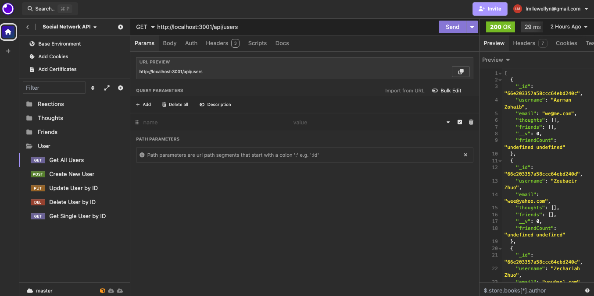

# Social Network API

## Description

As a developer of a social media startup I have made a social network API using mongoose.

## Installation

The user needs to install the `mongoose` and `express`dependencies to utilize this program.

## Usage

Using Insomnia the user will be able to utilize the different route requests to obtain/provide information from/to the social network API.

## Links
[walkthrough-video-user](https://drive.google.com/file/d/1uiNiWq_sz6QnBauwG2GwrQhzHx459oXP/view?usp=sharing)

[walkthough-video-thoughts](https://drive.google.com/file/d/1CchJePz0nri7wo_lFHWFCQWNDLhTh7_i/view?usp=drive_link)

[github-repo](https://github.com/lllewell/soc-net-api-nosql)

